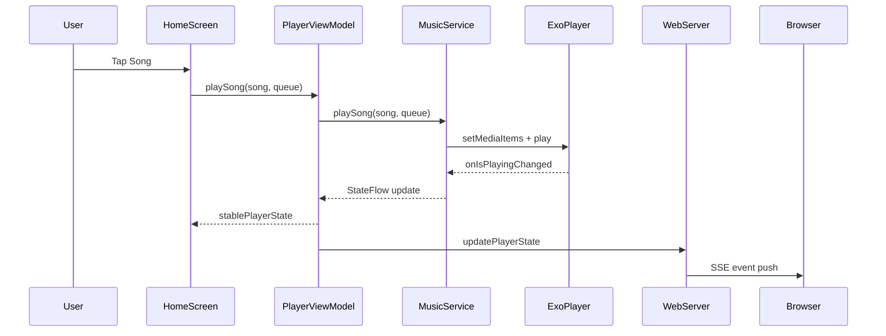
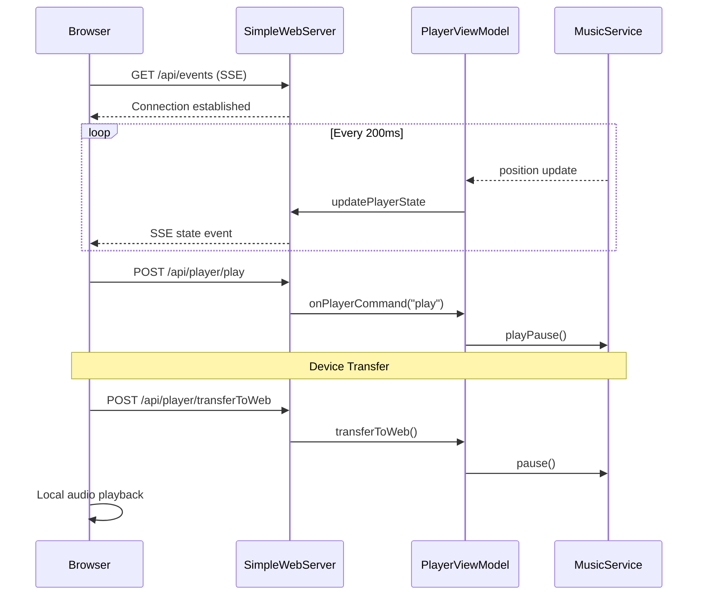
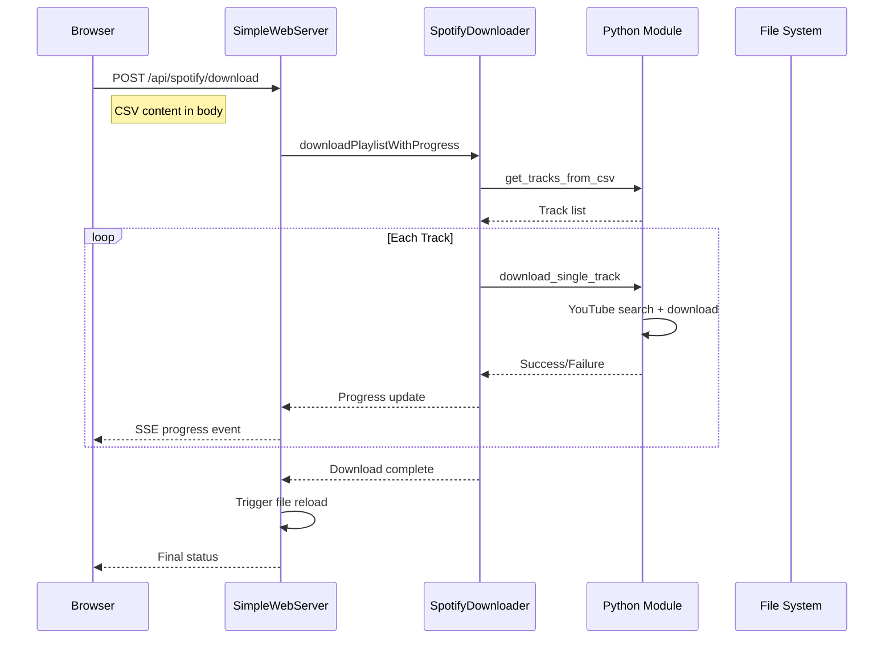

# Resonanz

A modern Android music player with web sync, playlist sharing, and Spotify import capabilities.

## Features

- **Local Music Playback** - Play music from MediaStore and custom uploaded files
- **Playlist Management** - Create, edit, and organize playlists
- **Web Sync Interface** - Control playback from any browser on your network
- **Spotify CSV Import** - Download your Spotify playlists via Python/Chaquopy
- **Cross-Device Playback Transfer** - Seamlessly transfer playback between phone and web
- **QR Code Playlist Sharing** - Share playlists with other Resonanz devices
- **Recently Played Tracking** - Quick access to your listening history
- **Media Notification Controls** - Full playback control from the notification

---

## Architecture

### System Overview

```mermaid
flowchart TB
    subgraph external [External Systems]
        Browser[Web Browser]
        OtherDevice[Other Resonanz Device]
        SpotifyExport[Spotify CSV Export]
        AndroidSystem[Android System]
    end

    subgraph models [Data Models]
        Song["Song
        ─────────────
        id, title, artist
        album, path, duration
        albumArtUriString
        contentUriString"]
        
        Playlist["Playlist
        ─────────────
        id, name
        songs: List of String"]
        
        PlayerState["StablePlayerState
        ─────────────
        currentSong, isPlaying
        totalDuration
        isShuffleEnabled
        repeatMode"]
        
        DownloadState["DownloadState
        ─────────────
        Idle, Initializing
        Downloading, Completed
        Cancelled, Error"]
    end

    subgraph ui [UI Layer - Jetpack Compose]
        subgraph activity [Activity]
            MainActivity["MainActivity.kt
            ─────────────
            loadSongsFromMediaStore
            startServer, stopServer
            deleteSong, deleteSongs
            importPlaylistFromUrl"]
        end
        
        subgraph screens [Screens]
            HomeScreen["HomeScreen.kt
            ─────────────
            Recently Played
            All Songs Grid
            Quick Actions"]
            
            LibraryScreen["LibraryScreen.kt
            ─────────────
            Tabs: Songs, Albums
            Artists, Playlists
            Album/Artist Detail"]
            
            SyncScreen["SyncScreen.kt
            ─────────────
            Server Status
            IP Address Display
            QR Scanner Button"]
            
            PlaylistDetail["PlaylistDetailScreen.kt
            ─────────────
            Song List
            Play, Shuffle
            Share, Delete"]
        end
        
        subgraph components [UI Components]
            MiniPlayer["MiniPlayer.kt
            ─────────────
            Collapsed View
            Play/Pause, Next"]
            
            FullPlayer["FullPlayer.kt
            ─────────────
            Album Art, Lyrics
            Seek Bar, Controls
            Shuffle, Repeat"]
            
            PlaylistDialogs["Dialogs
            ─────────────
            AddToPlaylistSheet
            PlaylistShareDialog
            PlaylistImportDialog"]
            
            SmartImage["SmartImage.kt
            ─────────────
            Coil Image Loading
            Album Art Display"]
            
            WavySlider["WavyMusicSlider.kt
            ─────────────
            Animated Seek Bar"]
        end
    end

    subgraph viewmodels [ViewModel Layer]
        PlayerVM["PlayerViewModel.kt
        ─────────────
        connect, disconnect
        playSong, playPause
        seekTo, nextSong, previousSong
        toggleShuffle, toggleRepeat
        transferToWeb, transferToPhone
        expandPlayer, collapsePlayer"]
        
        PlaylistVM["PlaylistViewModel.kt
        ─────────────
        loadPlaylists
        createPlaylist
        addSongToPlaylist
        removeSongFromPlaylist
        deletePlaylist"]
    end

    subgraph services [Service Layer]
        MusicService["MusicService.kt
        ─────────────
        MediaSessionService
        ExoPlayer Instance
        ─────────────
        playSong, playPause
        seekTo, nextSong
        previousSong
        toggleShuffle
        toggleRepeat"]
        
        NotificationProvider["MusicNotificationProvider.kt
        ─────────────
        Media Notification
        Custom Actions
        Shuffle/Repeat Buttons"]
    end

    subgraph dataLayer [Data Layer]
        PlaylistMgr["PlaylistManager.kt
        ─────────────
        playlists.json
        ─────────────
        create, delete, rename
        addSong, removeSong
        reorderSongs
        exportForShare
        importPlaylist"]
        
        RecentMgr["RecentlyPlayedManager.kt
        ─────────────
        SharedPreferences
        ─────────────
        recordPlay
        getRecentSongIds"]
        
        MediaStore["Android MediaStore
        ─────────────
        Audio.Media
        EXTERNAL_CONTENT_URI"]
    end

    subgraph network [Network Layer]
        WebServer["SimpleWebServer.kt
        ─────────────
        NanoHTTPD Port 8080
        ─────────────
        SSE Connections
        Device Management
        Player State Sync"]
        
        ShareMgr["PlaylistShareManager.kt
        ─────────────
        parseShareUrl
        importPlaylist
        downloadSong"]
        
        SpotifyDL["SpotifyDownloader.kt
        ─────────────
        Chaquopy Python
        ─────────────
        initialize
        downloadPlaylist
        cancelDownload"]
        
        QrScanner["QrScannerActivity.kt
        ─────────────
        ZXing Integration
        URL Detection"]
    end

    subgraph webapi [Web API Endpoints]
        direction LR
        API_Songs["/api/songs"]
        API_Upload["/api/upload"]
        API_Stream["/api/stream/{id}"]
        API_Player["/api/player/state"]
        API_Control["/api/player/play,pause,next,prev,seek"]
        API_Playlists["/api/playlists"]
        API_Share["/share/playlist/{id}"]
        API_SSE["/api/events SSE"]
        API_Spotify["/api/spotify/download"]
        API_Devices["/api/devices"]
    end

    %% UI Connections
    MainActivity --> HomeScreen
    MainActivity --> LibraryScreen
    MainActivity --> SyncScreen
    MainActivity --> MiniPlayer
    MainActivity --> FullPlayer
    
    HomeScreen --> PlayerVM
    LibraryScreen --> PlayerVM
    LibraryScreen --> PlaylistVM
    LibraryScreen --> PlaylistDetail
    MiniPlayer --> PlayerVM
    FullPlayer --> PlayerVM
    PlaylistDialogs --> PlaylistVM

    %% ViewModel to Service
    PlayerVM -->|"playSong, playPause\nseekTo, toggleShuffle"| MusicService
    PlayerVM -->|"MediaController\nconnect/disconnect"| MusicService
    PlaylistVM --> PlaylistMgr

    %% Service Connections
    MusicService --> NotificationProvider
    MusicService -->|"Query Songs"| MediaStore
    MainActivity -->|"loadSongsFromMediaStore"| MediaStore

    %% Data Flow
    PlayerVM -->|"recordPlay"| RecentMgr
    PlaylistMgr -->|"JSON read/write"| Playlist

    %% Network Connections
    MainActivity -->|"startServer"| WebServer
    WebServer --> PlaylistMgr
    WebServer -->|"downloadPlaylist"| SpotifyDL
    WebServer -->|"updatePlayerState"| PlayerVM
    
    %% External Connections
    Browser <-->|"HTTP/SSE"| WebServer
    Browser --> API_Songs
    Browser --> API_Player
    Browser --> API_SSE
    
    QrScanner -->|"scanned URL"| ShareMgr
    ShareMgr -->|"HTTP download"| OtherDevice
    SpotifyExport -->|"CSV upload"| API_Spotify
    
    %% Web API serves
    WebServer --> API_Songs
    WebServer --> API_Upload
    WebServer --> API_Stream
    WebServer --> API_Player
    WebServer --> API_Control
    WebServer --> API_Playlists
    WebServer --> API_Share
    WebServer --> API_SSE
    WebServer --> API_Spotify
    WebServer --> API_Devices

    %% State Updates
    MusicService -.->|"StateFlow"| PlayerState
    PlayerVM -.->|"stablePlayerState"| PlayerState
    SpotifyDL -.->|"downloadState"| DownloadState
```



---

### Playback Flow



---

### Web Sync Flow



---

### Spotify Download Flow



---

## Tech Stack

| Category | Technology |
|----------|------------|
| Language | Kotlin |
| UI | Jetpack Compose + Material 3 |
| Audio | Media3 ExoPlayer + MediaSession |
| Web Server | NanoHTTPD |
| Python | Chaquopy (spotdl integration) |
| QR Scanning | ZXing |
| Image Loading | Coil |
| Async | Kotlin Coroutines + Flow |

---

## Project Structure

```
app/src/main/java/com/resonanz/app/
├── MainActivity.kt              # Entry point, navigation
├── PlaylistManager.kt           # JSON playlist storage
├── PlaylistShareManager.kt      # Cross-device sharing
├── RecentlyPlayedManager.kt     # Play history
├── SimpleWebServer.kt           # NanoHTTPD web server
├── SpotifyDownloader.kt         # Python bridge
├── QrScannerActivity.kt         # ZXing scanner
├── model/
│   ├── Song.kt                  # Song data class
│   ├── Lyrics.kt                # Lyrics model
│   └── StablePlayerState.kt     # Player state
├── service/
│   ├── MusicService.kt          # Media3 service
│   └── MusicNotificationProvider.kt
├── ui/
│   ├── screens/                 # Full-screen composables
│   ├── components/              # Reusable UI components
│   └── theme/                   # Material theme
├── viewmodel/
│   ├── PlayerViewModel.kt       # Playback state
│   └── PlaylistViewModel.kt     # Playlist state
└── utils/
    └── FormatUtils.kt           # Time formatting
```

---

## Building

```bash
./gradlew assembleDebug
```

---

## Required Permissions

| Permission | Purpose |
|------------|---------|
| `INTERNET` | Web server and sync |
| `READ_MEDIA_AUDIO` | Access music files |
| `FOREGROUND_SERVICE_MEDIA_PLAYBACK` | Background playback |
| `POST_NOTIFICATIONS` | Media notifications |
| `CAMERA` | QR code scanning |
| `ACCESS_WIFI_STATE` | Get device IP for sync |

---

## Credits

This project was inspired by and references code from:

- **[PixelPlay](https://github.com/theovilardo/PixelPlay)** by [@theovilardo](https://github.com/theovilardo) - A modern offline music player for Android built with Kotlin and Jetpack Compose. Licensed under MIT.

---

## License

MIT License
